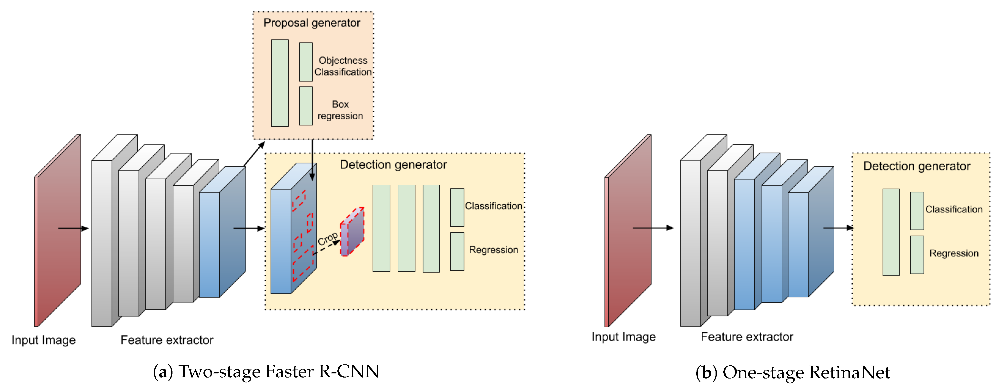
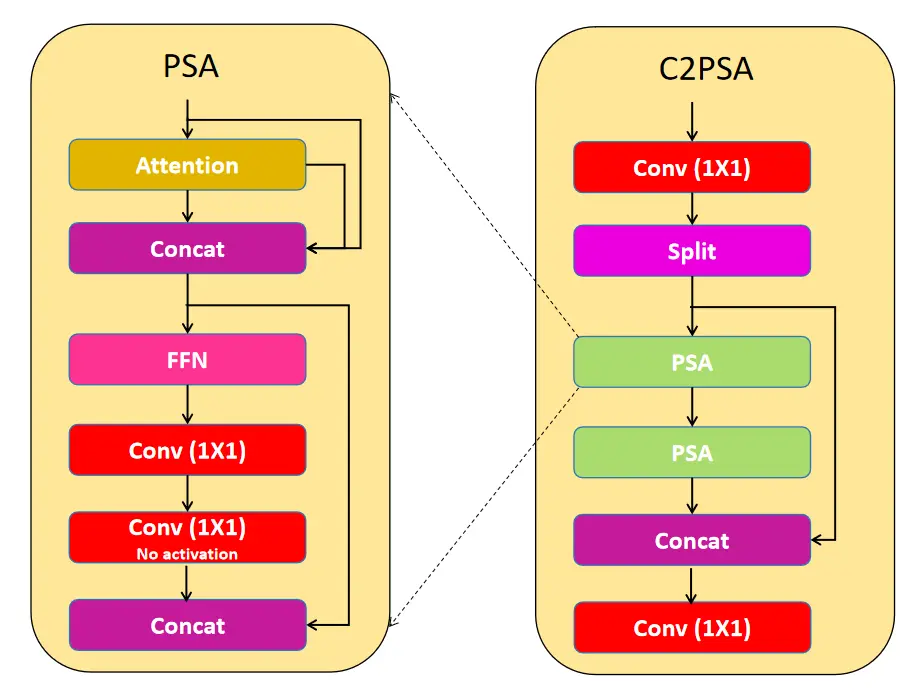
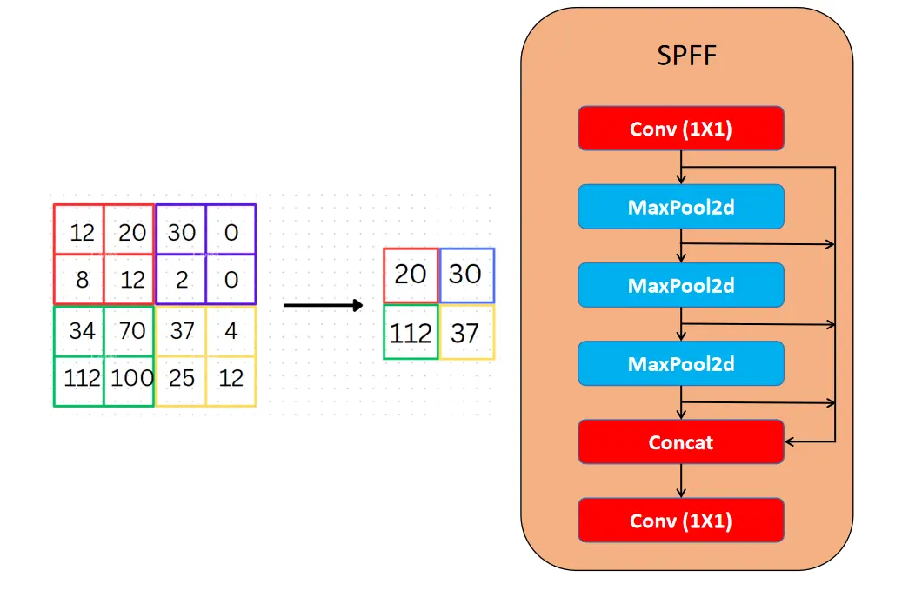

<h1 align="center">Object Detection</h1>

    
    

---

# Pengantar Object Detection

    

Secara umum, tujuan dari object detection adalah menentukan `lokasi` dan `kategori objek` di dalam sebuah citra, melabeli objek dengan kotak yang disebut `bounding box` dan menampilkan nilai confidence dalam bentuk persentase.

    

Perbandingan image classification, object localization, dan object detection. `Image classification` hanya berfokus `menentukan kategori objek` dengan menganalisis keseluruhan citra. `Object localization` kemudian `menambahkan penentuan lokasi` dari objek yang ada pada citra. Kedua jenis tugas ini diimplementasikan pada kasus `single object`. Penggabungan classification dan localization untuk multiple objects kemudian disebut sebagai `object detection`. Kemampuan inilah yang membuat object detection sangat cocok digunakan pada pemahaman citra dan analisis video.

    

Pada proses pendeteksian suatu objek, terdapat dua metode dalam menyelesaikan tugas tersebut diantaranya `one-stage` dan `two-stage` detectors. `One-stage-detector` menggunakan jaringan tunggal `feed-forward fully convolutional` yang secara langsung menyediakan `bounding box` dan `klasifikasi objek`. `Two-stage-detector` terdiri dari proses `region proposal` dan `tahap klasifikasi`. Beberapa algoritma Object Detection yang menggunakan `one-stage-detector` adalah `YOLO` dan `SSD`, sedangkan algoritma Object Detection yang menggunakan `two-stage-detector` adalah RCNN, Fast RCNN, dan Faster RCNN.

## Algoritma Deep Learning

Deep Learning memiliki berbagai jenis algoritma untuk menyelesaikan masalah yang spesifik. Convolutional Neural Network (CNN) merupakan salah satu algoritma utama yang digunakan untuk mengekstrak ciri dari citra. Arsitektur pada CNN terdiri dari convolution layers, pooling layers, dan fully connected layers. CNN umum digunakan pada arsitektur image classification dan object detection.

## YOLO

    

You Only Look Once (YOLO) adalah algoritma object detection yang menggunakan convolutional neural network dan darknet sebagai jaringan dasar untuk training dan inferensi. YOLO memiliki 24 lapisan konvolusi dengan 2 fully connected layers. Detektor ini juga menggunakan 1 × 1 reduction layers diikuti dengan 3 × 3 convolutional layers.

    

Pada image classification biasanya input mempunyai ukuran resolusi 224 × 224, tapi resolusi tersebut terlalu kecil. Objek-objek kecil ini bisa jadi tidak terdeteksi karena detail objek yang tidak terlihat, maka resolusi untuk object detection dinaikkan menjadi 448 × 448.

    

YOLO memiliki mAP terendah daripada algoritma Object Detection menggunakan `two-stage-detector` (RCNN, Fast RCNN, dan Faster RCNN). Tetapi YOLO memiliki kecepatan yang realtime (45 FPS) karena YOLO hanya sekali lewat CNN untuk mendapatkan bounding box dan klasifikasinya.

    

Terdapat beberapa versi dari perkembangan YOLO berdasarkan penelitian-penelitian sebelumnya, diantaranya YOLOv5, YOLOv8, YOLOv9. Berikut perbandingannya dengan YOLOv11.

    

## YOLOv11

YOLO adalah algoritma object detection yang terkenal karena kecepatan dan akurasinya, memproses seluruh citra dalam satu forward pass jaringan. YOLO pertama kali diperkenalkan oleh Joseph Redmon pada tahun 2015 dan telah berkembang pesat hingga versi terbaru yaitu YOLOv11.

YOLOv11 adalah versi terbaru dari YOLO yang mengusung peningkatan di berbagai area, termasuk kecepatan inferensi dan akurasi deteksi. YOLOv11 menawarkan deteksi objek secara real-time dengan frame rate tinggi, serta akurasi yang lebih baik pada objek dengan berbagai ukuran, detail arsitekur dapat dilihat pada gambar di bawah ini.

    

Berdasarkan file .yaml model YOLOv11 memiliki struktur model sebagai berikut:

1. Backbone
1. Neck (Path Aggregation Network)
1. Detection Head

### 1. Backbone

Backbone adalah komponen penting dalam arsitektur YOLO yang bertanggung jawab untuk mengekstrak fitur dari citra masukan pada berbagai skala. Proses ini melibatkan tumpukan lapisan konvolusi dan blok spesial untuk menghasilkan peta fitur dengan berbagai resolusi.

#### 1.1 Lapisan Konvolusi dan Blok C3k2

YOLOv11 mempertahankan struktur yang mirip dengan versi-versi sebelumnya, menggunakan lapisan konvolusi awal untuk menurunkan resolusi citra. Lapisan-lapisan ini membentuk dasar dari proses ekstraksi fitur, secara bertahap mengurangi dimensi spasial sambil meningkatkan jumlah saluran. Salah satu peningkatan signifikan pada YOLOv11 adalah pengenalan blok **C3k2**, yang menggantikan blok **C2f** yang digunakan pada versi sebelumnya. Blok **C3k2** adalah implementasi yang lebih efisien secara komputasi dari **Cross Stage Partial (CSP) Bottleneck**. Blok ini menggunakan dua konvolusi kecil daripada satu konvolusi besar, seperti yang terlihat pada YOLOv8. "k2" dalam **C3k2** merujuk pada ukuran kernel yang lebih kecil, yang berkontribusi pada pemrosesan yang lebih cepat sambil tetap mempertahankan kinerja yang baik.

    

### 2. Neck

Neck menggabungkan fitur dari berbagai skala dan mengirimkannya ke head untuk prediksi. Proses ini umumnya melibatkan upsampling dan konkatenasi peta fitur dari berbagai tingkat, memungkinkan model untuk menangkap informasi multi-skala dengan efektif.

#### 2.1 SPPF dan C2PSA

YOLOv11 tetap menggunakan blok **Spatial Pyramid Pooling - Fast (SPPF)** dari versi sebelumnya, namun memperkenalkan blok baru **C2PSA (Cross Stage Partial with Spatial Attention)** setelahnya. Blok **C2PSA** ini merupakan penambahan yang signifikan untuk meningkatkan perhatian spasial dalam peta fitur. Mekanisme perhatian spasial ini memungkinkan model untuk lebih fokus pada area-area penting dalam citra. Dengan melakukan pooling fitur secara spasial, **C2PSA** memungkinkan YOLOv11 untuk memfokuskan perhatian pada area-area yang menjadi perhatian utama, yang berpotensi meningkatkan akurasi deteksi untuk objek dengan ukuran dan posisi yang bervariasi.

    

    

#### 2.2 Blok C3k2

YOLOv11 memperkenalkan perubahan signifikan dengan mengganti blok **C2f** di bagian neck dengan blok **C3k2**. Blok **C3k2** ini dirancang untuk lebih cepat dan lebih efisien, meningkatkan kinerja keseluruhan dalam proses agregasi fitur. Setelah upsampling dan konkatenasi, neck di YOLOv11 menggunakan blok yang lebih efisien ini, yang menghasilkan peningkatan kecepatan dan kinerja.

    

#### 2.3 Mekanisme Perhatian (Attention Mechanism)

Salah satu penambahan penting pada YOLOv11 adalah peningkatan fokus pada perhatian spasial melalui modul **C2PSA**. Mekanisme perhatian ini memungkinkan model untuk lebih memusatkan perhatian pada wilayah kunci dalam citra, yang berpotensi menghasilkan deteksi yang lebih akurat, terutama untuk objek yang lebih kecil atau terhalang sebagian. Penambahan **C2PSA** ini membedakan YOLOv11 dari pendahulunya, seperti YOLOv8, yang tidak memiliki mekanisme perhatian ini.

### 3. Head

Head pada YOLOv11 bertanggung jawab untuk menghasilkan prediksi akhir dalam bentuk deteksi objek dan klasifikasi. Proses ini melibatkan pemrosesan peta fitur yang diteruskan dari neck, yang akhirnya menghasilkan bounding box dan label kelas untuk objek dalam citra.

#### 3.1 Blok C3k2

Di bagian head, YOLOv11 menggunakan beberapa blok **C3k2** untuk memproses dan menyempurnakan peta fitur secara efisien. Blok **C3k2** ini ditempatkan di beberapa jalur dalam head dan berfungsi untuk memproses fitur multi-skala pada berbagai kedalaman. Blok **C3k2** memiliki fleksibilitas yang bergantung pada nilai parameter **c3k**:

- **c3k = False**: Blok **C3k2** berfungsi mirip dengan blok **C2f**, menggunakan struktur bottleneck standar.
- **c3k = True**: Struktur bottleneck digantikan dengan modul **C3**, yang memungkinkan ekstraksi fitur yang lebih dalam dan lebih kompleks.

**Karakteristik utama blok C3k2**:

- **Pemrosesan lebih cepat**: Penggunaan dua konvolusi kecil mengurangi beban komputasi dibandingkan dengan satu konvolusi besar, yang menghasilkan ekstraksi fitur lebih cepat.
- **Efisiensi parameter**: **C3k2** adalah versi lebih kompak dari **CSP bottleneck**, membuat arsitektur lebih efisien dalam hal jumlah parameter yang dapat dilatih.

Selain itu, ada juga blok **C3k**, yang menawarkan fleksibilitas lebih dengan memungkinkan ukuran kernel yang dapat disesuaikan. Fleksibilitas ini sangat berguna untuk mengekstrak fitur yang lebih detail dari citra, yang berkontribusi pada peningkatan akurasi deteksi.

#### 3.2 Blok CBS

Head YOLOv11 mencakup beberapa lapisan **CBS (Convolution-BatchNorm-Silu)** setelah blok **C3k2**. Lapisan CBS ini lebih lanjut menyempurnakan peta fitur dengan cara:

- Mengekstraksi fitur relevan untuk deteksi objek yang akurat.
- Menstabilkan dan menormalkan aliran data melalui **batch normalization**.
- Menggunakan fungsi aktivasi **Sigmoid Linear Unit (SiLU)** untuk menambah non-linearitas, yang meningkatkan kinerja model.

Blok CBS berfungsi sebagai komponen dasar dalam ekstraksi fitur dan proses deteksi, memastikan bahwa peta fitur yang telah disempurnakan diteruskan ke lapisan berikutnya untuk prediksi bounding box dan klasifikasi objek.

#### 3.3 Lapisan Konvolusi Terakhir dan Lapisan Deteksi

Setiap cabang deteksi diakhiri dengan serangkaian lapisan **Conv2D**, yang mereduksi fitur menjadi jumlah output yang dibutuhkan untuk koordinat bounding box dan prediksi kelas. Lapisan **Detect** akhir mengonsolidasikan prediksi ini, yang mencakup:

- **Koordinat bounding box** untuk melokalisasi objek dalam citra.
- **Skor objektivitas** yang menunjukkan keberadaan objek.
- **Skor kelas** untuk menentukan kelas dari objek yang terdeteksi.

Sebelum terbentuk bounding box diperlukan `anchor box` untuk membuat prediksi bounding box. `Detection head` memiliki empat output dan peran masing-masing output adalah untuk mendeteksi objek sesuai dengan skalanya.

    

1. P3/8 adalah untuk mendeteksi objek yang lebih kecil.
2. P4/16 adalah untuk mendeteksi objek medium.
3. P5/32 adalah untuk mendeteksi objek yang lebih besar.
4. P6/64 adalah untuk mendeteksi objek yang lebih ekstra besar.

Ketika akan mendeteksi objek yang lebih kecil, maka perlu menggunakan `anchor box` yang lebih kecil dan untuk objek sedang Anda harus menggunakan anchor box skala menengah, begitu seterusnya.

    

    

    

`Detection head` menghasilkan output vektor terakhir dengan `bounding box (x,y,w,h)`, `skor objektivitas`, dan `probabilitas kelas`.

## Performa Model YOLOv11

YOLOv11 terdiri dari beberapa jenis arsitektur dengan tingkat performansi yang berbeda-beda. Perbedaan seri YOLOv11 terdapat pada `nilai AP`, `Params`, dan `FLOPs`. Perbandingan performansi seri YOLOv11 dapat dilihat pada gambar dibawah ini.

     

    

Pada gambar tersebut, terlihat bahwa seri YOLOv11x memiliki nilai Average Precision (AP), jumlah parameter (Params), dan Floating Point Operations per Second (FLOPs) paling tinggi dibandingkan dengan seri-seri YOLOv11 lainnya pada validasi dataset COCO. Hal ini menunjukkan bahwa YOLOv11x adalah varian dengan akurasi deteksi objek terbaik, karena nilai AP yang tinggi mengindikasikan bahwa model ini dapat mengenali objek dengan tingkat presisi yang lebih tinggi. Selain itu, Params yang lebih banyak menunjukkan bahwa model ini lebih kompleks dan memiliki lebih banyak kapasitas untuk mempelajari fitur-fitur halus dalam citra, yang berkontribusi pada akurasi deteksi yang lebih baik. Namun, kompleksitas ini juga tercermin dalam FLOPs yang lebih tinggi, yang berarti model YOLOv11x memerlukan lebih banyak komputasi untuk menjalankan deteksi, sehingga memperlambat waktu inferensi dibandingkan dengan model lainnya. Meskipun memiliki keunggulan dalam akurasi dan kompleksitas, penggunaan YOLOv11x mungkin tidak optimal untuk aplikasi yang membutuhkan deteksi real-time dengan keterbatasan sumber daya komputasi. Seri YOLOv11 lainnya seperti YOLOv11m, YOLOv11s, dan YOLOv11n memiliki nilai AP yang lebih rendah namun inferensi yang lebih cepat.

## Evaluasi Model

### Mean Average Precision

Penggunaan parameter kinerja mAP sangat populer pada sistem object detection. mAP merupakan rata-rata dari semua nilai Average Precision (AP) setiap kelas objek. Sedangkan AP adalah nilai integral atau area di bawah kurva Precision (P) × Recall (R) dari suatu kelas objek seperti pada gambar dibawah ini.

    

Secara matematis, mAP dapat dihitung menggunakan persamaan

    

dengan,

    

C merupakan jumlah kelas objek dan N merupakan jumlah semua titik interpolasi nilai P terhadap nilai R.

    

Berdasarkan gambar diatas, hasil interpolasi ini akan dijadikan estimasi luas area di bawah kurva Precision × Recall. Proses interpolasi ini dilakukan dengan mencari nilai P maksimum pada setiap titik Re yang memiliki nilai lebih besar atau sama dengan nilai R pada titik berikutnya (Rn+1).

Sementara itu, dalam menghitung P dan R perlu melihat nilai-nilai dari confusion matrix seperti pada gambar dibawah ini. Setelah mendapatkan confusion matrix, maka P dan R bisa dihitung dengan persamaan

    

Standar perhitungan mAP@0.5 PASCAL VOC menggunakan Intersection Over Union (IoU) seperti pada gambar dibawah ini yang digunakan sebagai ambang batas penentuan TP dan FP dari confusion matrix. Adapun definisi dari setiap komponen confusion matrix tersebut adalah sebagai berikut.

    

1. TP mendefinisikan bounding-box hasil deteksi yang memiliki IoU ≥ 0,5.
1. FP mendefinisikan bounding-box hasil deteksi yang memiliki IoU   

# Sistematika Pengerjaan

- Buatlah program `Deep Learning` berupa `Object Detection`.

- Input berupa gambar dan output berupa gambar yang sama dengan _bounding box_ beserta labelnya.

- Model yang digunakan adalah `YOLOv11`, silahkan pilih variasi model sesuai dengan kebutuhan.

- Dataset berupa wajah kelompok dengan minimal **150 gambar** per orang, silahkan merujuk pada tautan berikut untuk [**`Pembuatan Dataset`**](/Create_Dataset/README.md).

- Model yang dirancang berupa `Transfer Learning` atau menggunakan `YOLO Pre-Trained Model` yang kemudian dilatih kembali dengan dataset yang telah dibuat.

- Evaluasi model dilakukan dengan gambar di luar dataset.

- Output berupa file `.ipynb` beserta tautan `Dataset di Roboflow`.

- Tugas dikumpulkan pada tautan berikut [**`Pengumpulan Tugas Akhir Transfer Learning`**](https://forms.gle/xAnxGZVXCEA3prED6)

  

# Code

- [**`Contoh Notebook untuk train model YOLO`**](https://www.kaggle.com/code/rafimahfuz/train-w-yolo)

  

# Referensi

- https://becominghuman.ai/understanding-anchors-backbone-of-object-detection-using-yolo-54962f00fbbb
- https://docs.ultralytics.com/models/yolo11/
- https://arxiv.org/html/2410.17725v1
